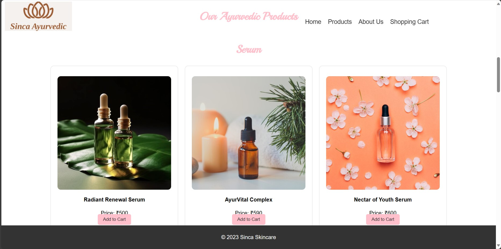
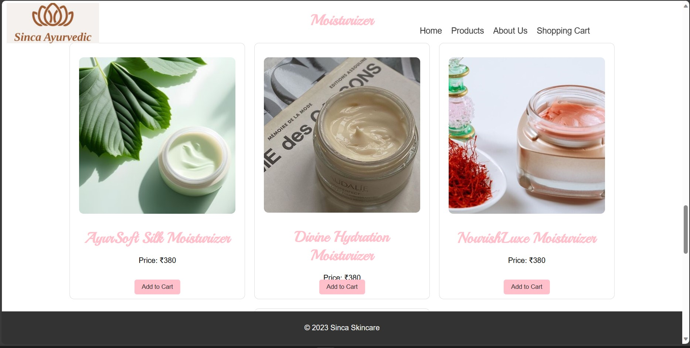
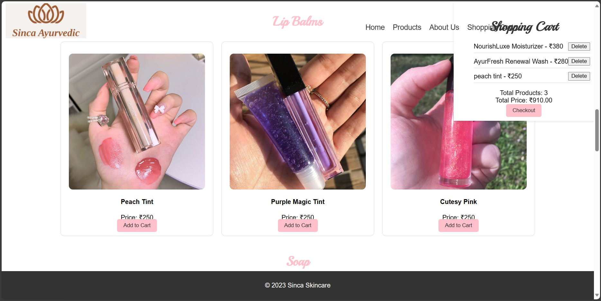
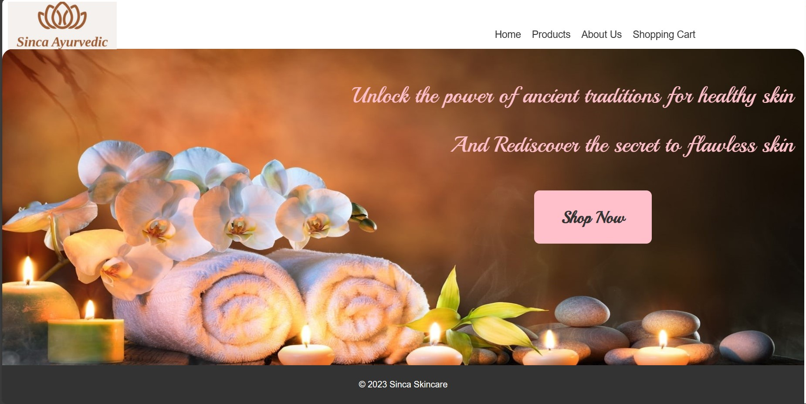

# sinca-skincare-ecommerce-website
using html,css,javascript


# Sinca Skincare Website

<p align="center">
  
</p>

## Introduction

Welcome to the Sinca Skincare Website, where ancient Ayurvedic traditions meet modern skincare solutions. This project showcases our commitment to providing users with a seamless and delightful experience as they explore our range of Ayurvedic skincare products. The website is designed to be visually appealing, user-friendly, and informative, reflecting the essence of Sinca Skincare.

## Features Highlights

### 🌟 Ancient Wisdom, Modern Solutions
Explore the power of Ayurveda with our meticulously crafted skincare products. Sinca Skincare combines traditional wisdom with modern science to offer a unique and effective range of serums, lip balms, cleansers, moisturizers, and more.

<p align="center">
  
</p>

### 📱 Responsive Design
Enjoy a consistent and engaging experience across devices. Our responsive design ensures that you can navigate through our website seamlessly, whether you're on a desktop, tablet, or mobile device.

<p align="center">
  
</p>

### 🛒 Effortless Shopping
Immerse yourself in a hassle-free shopping experience. Our intuitive product showcase allows you to browse through various categories, view product details, and add your favorite items to the cart with a single click.

<p align="center">
  
</p>

### 💼 Cart Management
Keep track of your selected products with our convenient shopping cart feature. Easily manage your cart items, view the total quantity, and get an instant update on the total price.

<p align="center">
  
</p>

### 🎨 Aesthetically Pleasing
Experience the beauty of skincare with our visually appealing design. The website incorporates soothing colors, elegant fonts, and high-quality images to create an atmosphere of tranquility and wellness.

<p align="center">
  
</p>

## Technologies Used

- **Frontend**: HTML, CSS, JavaScript, React
- **Backend**: Node.js, Express
- **Database**: MongoDB
- **Authentication**: JSON Web Tokens (JWT)
- **Payment Integration**: (Specify the payment gateway used)

## Getting Started

1. **Clone the repository:**
   ```bash
   git clone https://github.com/Saloni14112003/sinca-skincare.git

